# Ford-Johnson Algorithm Using C++

### background
In computer science, merge-insertion sort, or the Ford-Johnson algorithm, is a comparison sorting algorithm published in 1959 by L. R. Ford Jr. and Selmer M. Johnson. It uses fewer comparisons in the worst case than the best previously known algorithms, binary insertion sort and merge sort, and for 20 years, it was the sorting algorithm with the fewest known comparisons. Although not of practical significance, it remains of theoretical interest in connection with the problem of sorting with a minimum number of comparisons.

### Introduction
In this project, I attempted, after all my research, to understand how this algorithm works. I finally figured out how to implement it, and I'll explain it here in detail. I hope you understand and it makes it easy for you to implement it yourself.

## Usage
```
git clone https://github.com/Czarslayer/Ford-Johnson-algo-cpp.git && cd Ford-Johnson-algo-cpp && make
```
```
Usage: ./PmergeMe [numbers to sort separated by space ..]
```
## Steps

1. **Initialization**:
    - Let's start with our target sequence in this example:

    

2. **Pairing Elements**:
    - Pair the elements sequentially. If the number of elements is odd, leave the last element unpaired. We'll call it "struggle" for now.

    

3. **Sorting Pairs**:
    - Sort each pair. This results in a list where each pair is sorted, but pairs themselves are not necessarily in order (large first, then low second) using one comparison each.

    

4. **Sorting the Pairs**:
    - Sort the list of pairs using any efficient sorting algorithm by the largest of them but don't lose the pairs. Each element should still remember its pair. The sorting should be done using merge insertion sort recursively.

    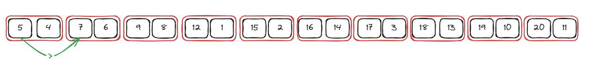

5. **Create Two Sequences B/S**:
    - Create two arrays: one for the largest elements (which are sorted) and one for the lowest elements (not sorted) of each pair.

    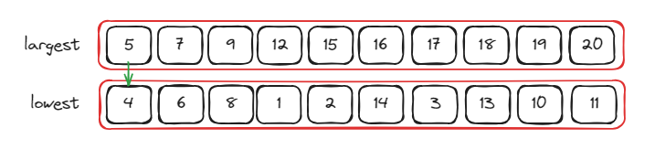
    First half done, now to the complicated part:

---

## Explanation

Now we need a way to insert the lowest sequence into the largest using as few comparisons as possible, which is the point of existence of the Ford-Johnson algorithm. Now my sequence looks like this:

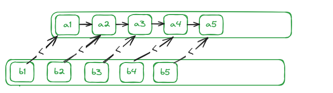

We have "a"s representing the largest and "b"s representing the lowest. If you pay close attention, we already know that b1 is smaller than the first element of the largest, so it's obvious that we're going to insert it first without needing any comparisons.

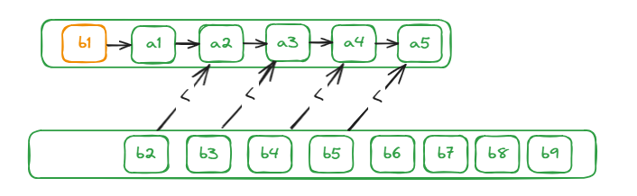

To actually use the Ford-Johnson algorithm, you need an insertion sequence. We're required to use the Jacobsthal sequence that goes like this:

```0, 1, 1, 3, 5, 11, 21, 43, 85, 171, 341, 683, 1365, 2731, 5461, 10923...```

You can generate it using this equation:

```a(n) = a(n-1) + 2*a(n-2), with a(0) = 0, a(1) = 1```

How is this related to the insertion we're going to do? Simple, this equation will generate the order of insertion as the range (to be explained later). Now we should only generate the number of our lowest sequence. In this case, it's 10, so we'll stop at 11, meaning we have this sequence:

```0, 1, 1, 3, 5, 11```

The algorithm indexing starts at 1, so the 0 in the sequence does not provide any meaningful split point for the sorting process because starting with an index of 0 means no elements to consider.

For the ```1```, we already sent the first element, so the sequence becomes:

```3, 5, 11```

Basically, we always start with 3 because the previous steps are always required. So the first element will always be inserted before.

Now we can't just push index 3, 5, and 11 and call it a day. Heck, we don't even have the 11th index. For that, the algorithm implies that we push the index first, then followed by every index below it like this:

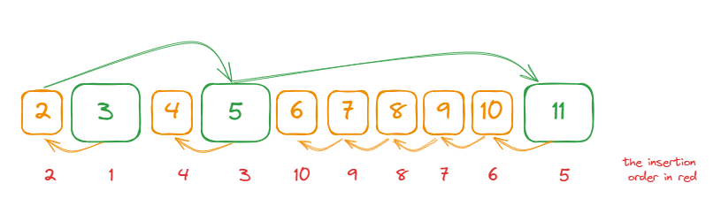

Next, we have this order of insertion. Notice that there's no 11th index; it got eliminated to only have the elements to be inserted.

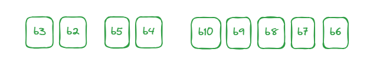

Now picture this: for each element we need to insert, we'll need to compare with each element of the parent sequence until we find the right place. That really defeats the purpose of the algorithm, which is to use as few comparisons as possible. For that, we use binary search. To use it, we need our sequence to be already sorted, and what do you know, we already did that with our largest sequence.

## Binary Search Brief Explanation
- Binary search is a search algorithm used to find the position of a target value within a sorted array. It works by repeatedly dividing the search interval in half until the target value is found or the interval is empty. The search interval is halved by comparing the target element with the middle value of the search space, cutting time complexity to O(log N).


Now that we have a way to insert and an order of insertion that uses as few comparisons as possible, wait, what's that? Want to optimize it more? Well, search no more. Introducing "only insert in a specific range." I would love to take credit, but no, it's also required by the algorithm.

Instead of binary searching the whole sequence for each number and losing more comparison power, we should only insert in a range of 0 to {2^(k) - 1}. What's k, you're asking? Well, it's the batch of the Jacobsthal sequence you're inserting. For example, when you reach index 11 and its subordinate indexes 10, 9, 8, 7, 6, this is a batch. Each element of the Jacobsthal original sequence creates its own batch.

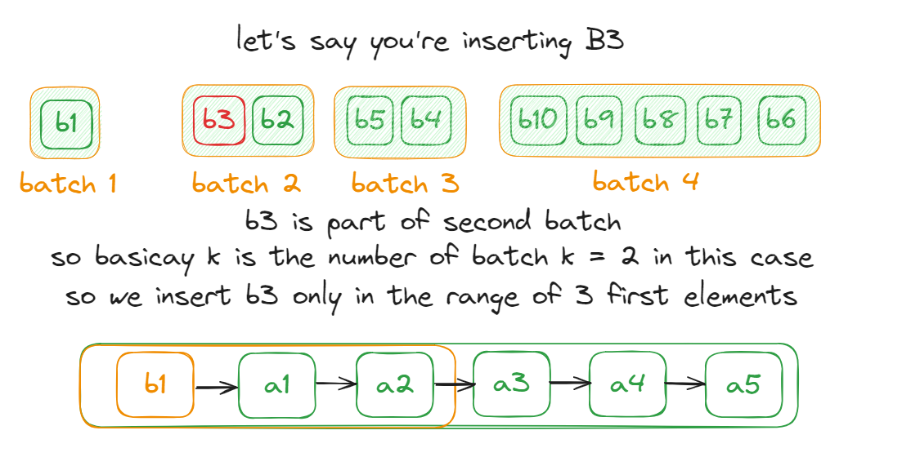

Now that we have everything we need ready and explained, let's apply it.


First, we know that the first element is ready to be inserted first.

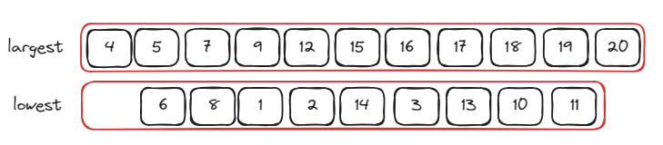

Now we need our insertion order. Batch one is number 4, already inserted.

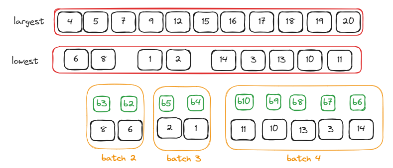

### We Start with Batch 2
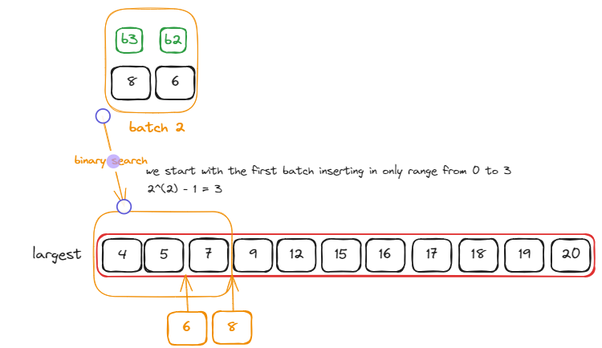

### Batch 3
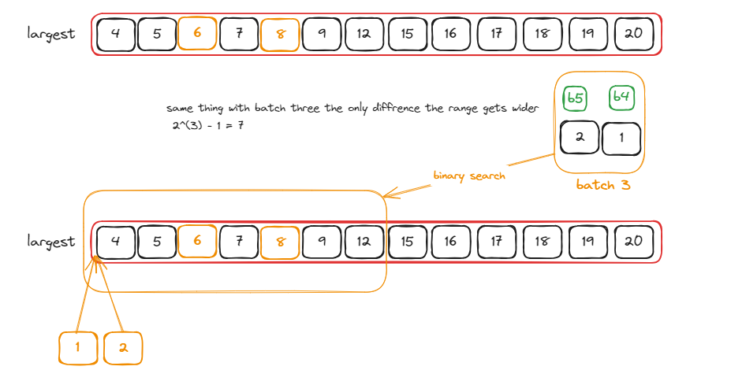

### Batch 4 and Last
- In this case, 15 is the size of the sequence, so batches beyond this point will be inserted into the entire sequence.

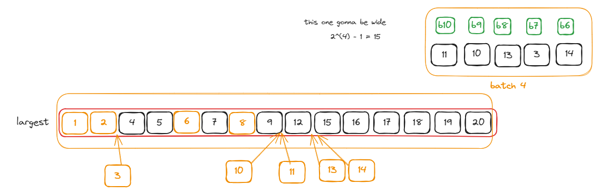

### And Finally
- Hope you didn't forget one number, yes, the struggle, the lonely one with no pair.

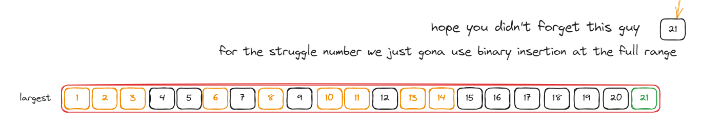


---

## Diagram

The following Excalidraw diagram provides a visual representation of each step:

[diagram](https://excalidraw.com/#json=dO7JUVc6rv4RO6SN6TipL,ua1fCMikPWKbZzMNU2bKWA)

---

## Conclusion

The Ford-Johnson merge-insert algorithm is a sophisticated method for sorting that combines merging and insertion techniques to achieve efficient sorting with minimal comparisons.

---

## References

- [Original Paper by Ford and Johnson](https://seriouscomputerist.atariverse.com/media/pdf/book/Art%20of%20Computer%20Programming%20-%20Volume%203%20(Sorting%20&%20Searching).pdf) (page 196)
- [Jacobsthal Sequence](https://oeis.org/A001045)
- [stack exchange](https://codereview.stackexchange.com/questions/116367/ford-johnson-merge-insertion-sort)